# Dipanshu Rana — CV / Resume Website · Screenshots

Captured on the live preview at: https://resume-showcase-504.preview.emergentagent.com
Viewport: 1440 × 900

---

## Dark Mode

### 1 · Hero
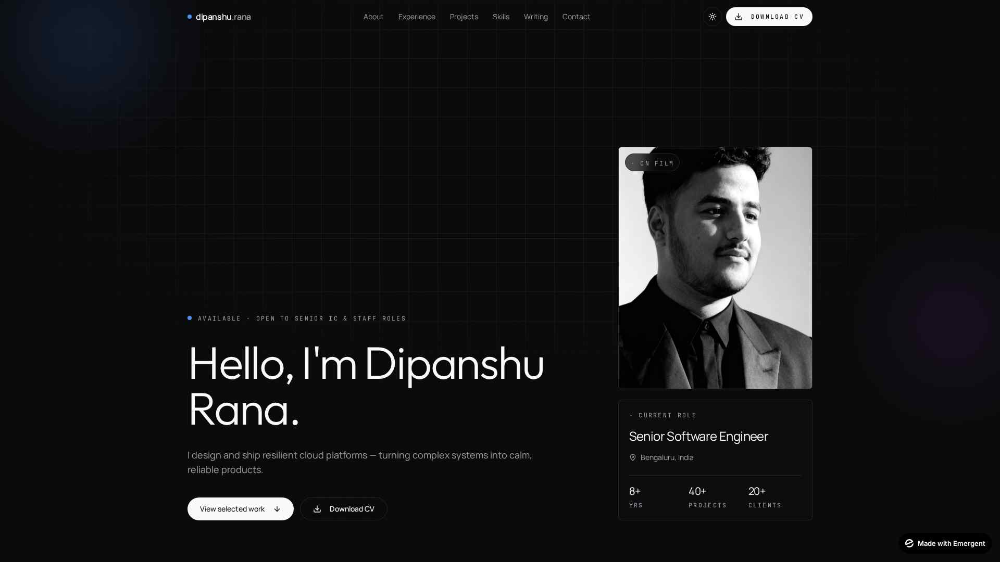

### 2 · About
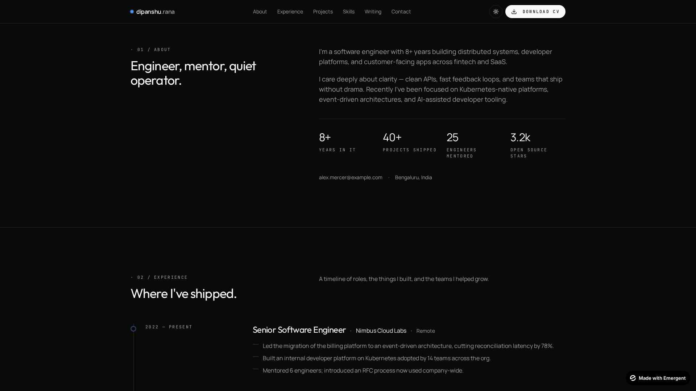

### 3 · Experience
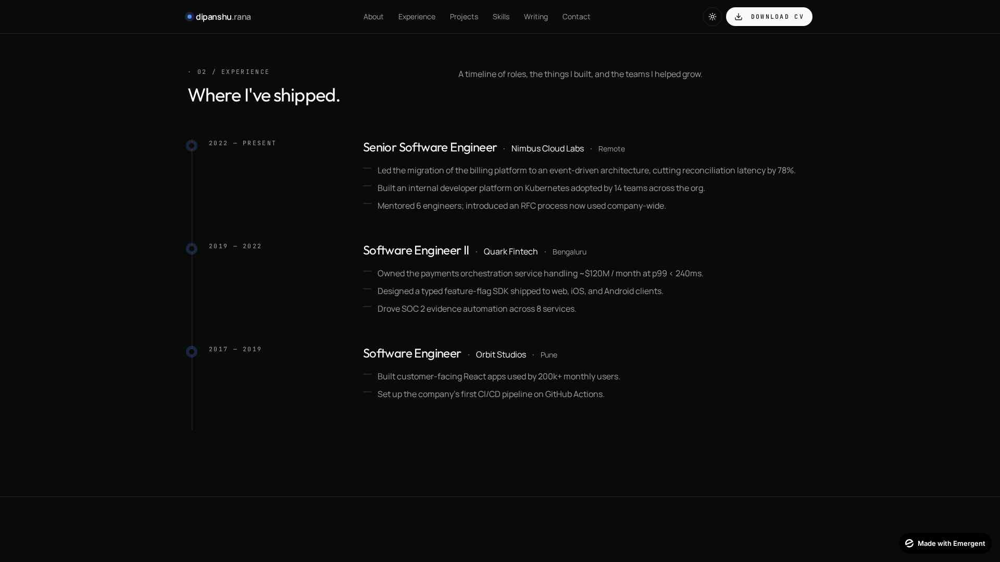

### 4 · Skills
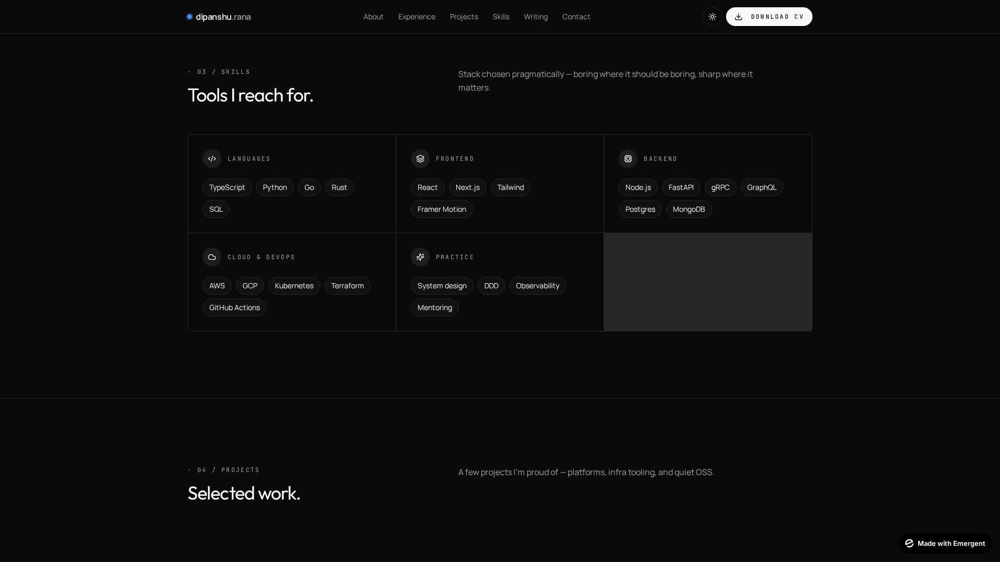

### 5 · Projects
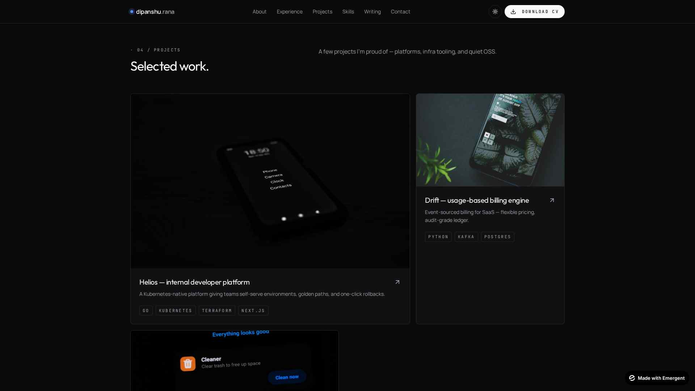

### 6 · Education & Certifications
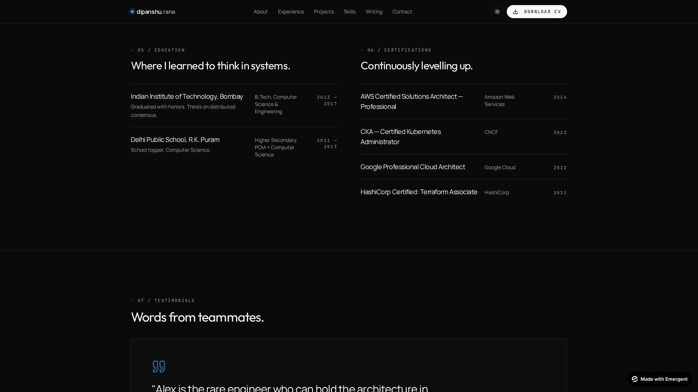

### 7 · Testimonials
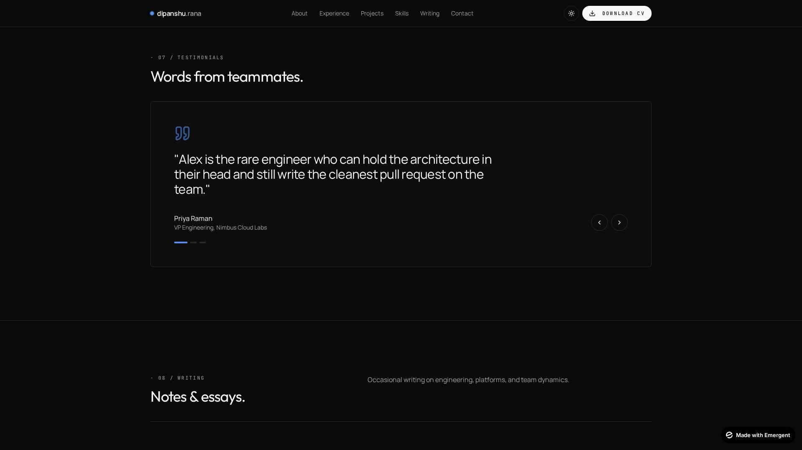

### 8 · Writing / Blog
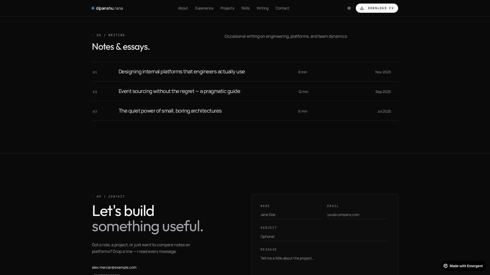

### 9 · Contact & Footer
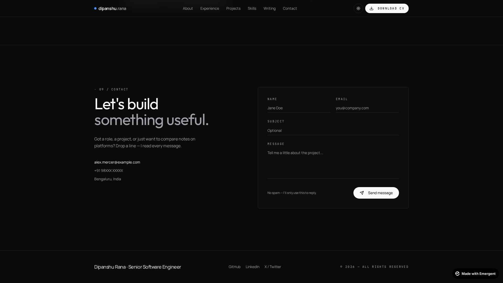

---

## Light Mode

### Hero — Light
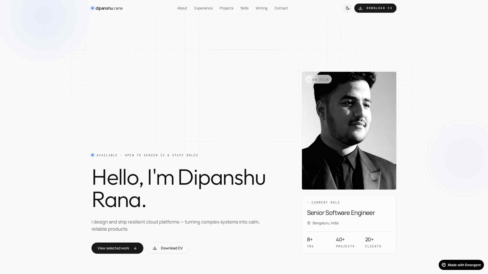

### Projects — Light
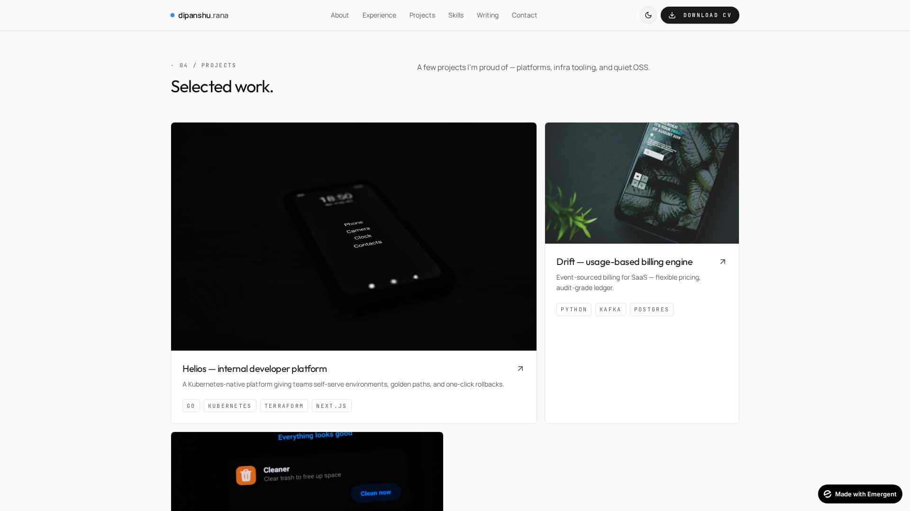

### Contact — Light
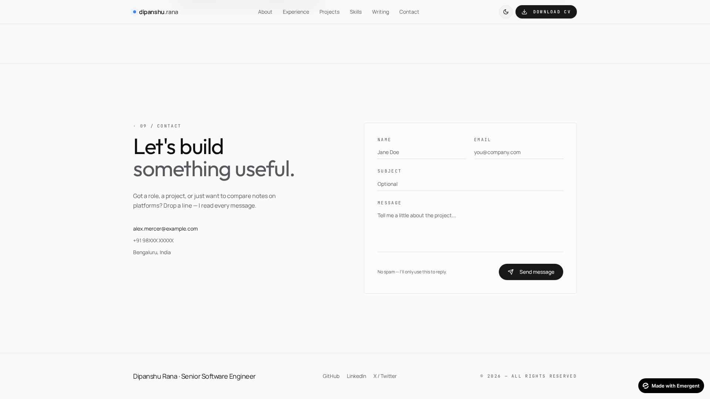

---

_All screenshots are stored in `/app/screenshots/` as JPEG._
